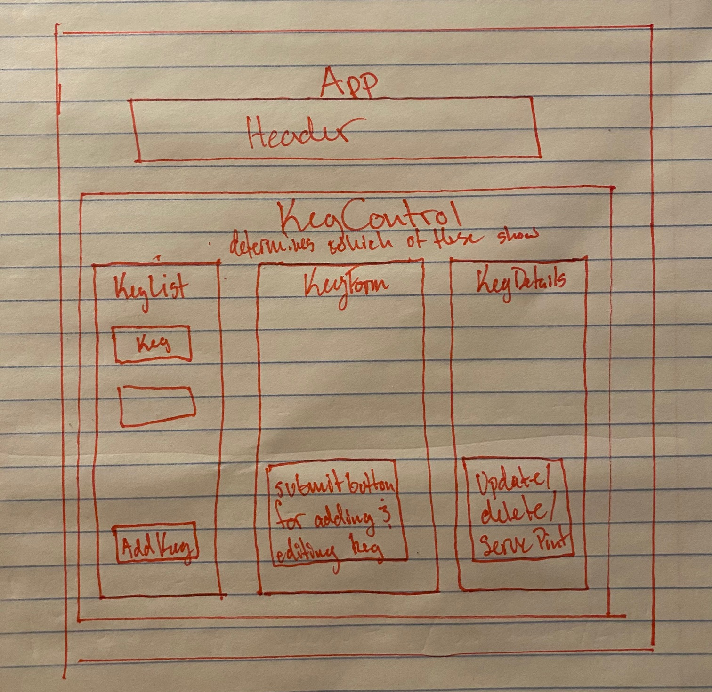

<h1 align="center"><strong>The Holy Spirits</strong></h1>
<h4 align="center"><em>React app that allows user to create, read, update, and delete kegs.</em></h4>

##### __Created:__ 11/20/2020
##### By _**Drew Parker**_  

## Description

This react app is built based on the following diagram. Users are able to add new keg records and details which are displayed in a list. List items can be selected which display the keg details where they can be deleted, updated, viewed. Kegs can also be "refilled" and pints can be "sold".

## Setup/Installation Requirements

1. Clone this repository onto your computer:
    "git clone https://github.com/drewjparker91/The-Holy-Spirits-Tap-House"
2. Navigate into the "top-room-friday-project" directory in Visual Studio Code or preferred text editor:
3. Open the project by typing "code ." while in the previous directory in your terminal.
4. Open your computer's terminal and navigate to the directory bearing the name of the program and containing the top level subdirectories and files.
5. Type "npm install" in your console to install necessary dependencies and allow use of the following scripts.

This project was bootstrapped with [Create React App](https://github.com/facebook/create-react-app).

In the project directory, you can run:

### `npm start`

Runs the app in the development mode. 
Open [http://localhost:3000](http://localhost:3000) to view it in the browser.

The page will reload if you make edits. 
You will also see any lint errors in the console.

### `npm test`

Launches the test runner in the interactive watch mode. 
See the section about [running tests](https://facebook.github.io/create-react-app/docs/running-tests) for more information.

### `npm run build`

Builds the app for production to the `build` folder. 
It correctly bundles React in production mode and optimizes the build for the best performance.

The build is minified and the filenames include the hashes. 
Your app is ready to be deployed!

See the section about [deployment](https://facebook.github.io/create-react-app/docs/deployment) for more information.

### `npm run eject`

**Note: this is a one-way operation. Once you `eject`, you can’t go back!**

If you aren’t satisfied with the build tool and configuration choices, you can `eject` at any time. This command will remove the single build dependency from your project.

Instead, it will copy all the configuration files and the transitive dependencies (webpack, Babel, ESLint, etc) right into your project so you have full control over them. All of the commands except `eject` will still work, but they will point to the copied scripts so you can tweak them. At this point you’re on your own.

You don’t have to ever use `eject`. The curated feature set is suitable for small and middle deployments, and you shouldn’t feel obligated to use this feature. However we understand that this tool wouldn’t be useful if you couldn’t customize it when you are ready for it.

## Learn More

You can learn more in the [Create React App documentation](https://facebook.github.io/create-react-app/docs/getting-started).

To learn React, check out the [React documentation](https://reactjs.org/).

## Known Bugs
* No Known bugs at this time

## Support and contact details

* Email: drewjparker91@gmail.com

## Technologies Used

* Visual Studio Code
* HTML
* CSS
* Bootstrap
* React

### License

Copyright (c) 2020 **_Drew Parker_**

This software is licensed under the MIT license.
